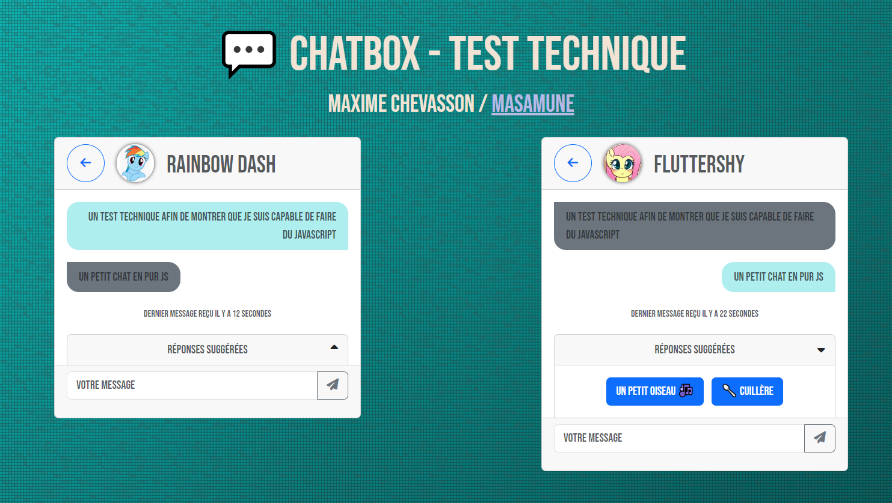

# Test technique / Chatbox / Evogue

Réalisé le 28/02/23.

Étapes des ralisations dans le [github](XXX).

Front réalisé en 2h.

Front ajusté pour comportement en 1h.

JS en ~3h.

Version [en ligne ici](http://stockage.masamune.fr/masamune/tests-techniques/javascript/chat-box/).

## Ressources

- [bootstrap](https://getbootstrap.com/)
- [font awesome](https://fontawesome.com/)
- [html](https://developer.mozilla.org/fr/docs/Web/HTML)
- [javascript](https://developer.mozilla.org/fr/docs/Web/JavaScript)
- [markdown](https://fr.wikipedia.org/wiki/Markdown)
